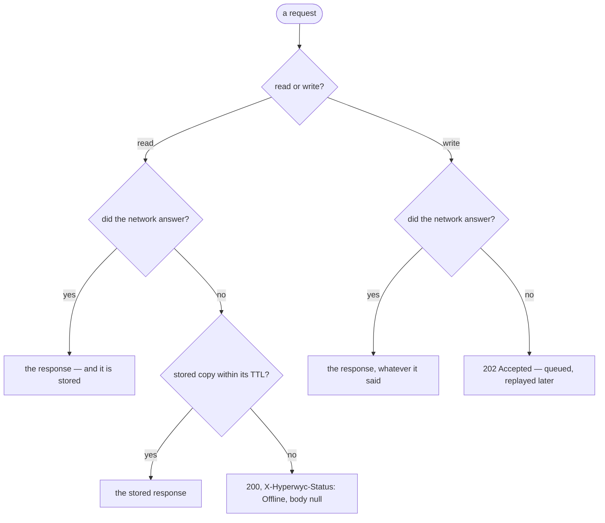

# Hyperwyc documentation

A Service Worker for .NET: an `HttpClient` handler that caches responses, queues writes it cannot send, and replays them when the network returns. Your calling code does not change.

## Start here

Pick the one that matches why you came.

|                                                    |                                                                                                                                             |
| -------------------------------------------------- | ------------------------------------------------------------------------------------------------------------------------------------------- |
| **[Is Hyperwyc right for your app?](choosing.md)** | You are evaluating. What it is for, what it is not for, how it compares to Realm and CommunityToolkit.Datasync, and what it does not do yet |
| **[Getting started](getting-started.md)**          | You have decided. Install, register, make a request — the whole setup is five lines                                                         |
| **[Hyperwyc in a .NET MAUI app](maui.md)**         | You are building for mobile. Everything a MAUI app needs on one page: connectivity, the encryption key, backup exclusion, AOT               |
| **[Tutorial](tutorial/)**                          | You would rather be shown. Five short pages building an app that keeps working when its API goes away                                       |

## What happens to a request

"Did the network answer?" deliberately covers both cases: the connectivity service said offline, or it said online and the transport could not connect. The caller cannot tell which, and does not need to — see [Design](design.md#connectivity-is-an-optimisation-not-a-correctness-input).

The one exception is a [`NetworkOnly`](delivery.md) route, which opts out of the store in both directions and does not queue writes at all.

## Reference

What each part does, in tables. Read a page when you need a fact from it.

| | |
|---|---|
| **[Delivery and route policies](delivery.md)** | Where a response comes from, how long it stays usable, and how to vary both per route |
| **[Offline writes](offline-writes.md)** | Queueing, replay, and what happens when a write fails |
| **[Synthetic responses](responses.md)** | The status codes and headers Hyperwyc returns when it answers instead of the server |
| **[Events](events.md)** | Finding out what the server eventually said about a deferred write |
| **[Connectivity](connectivity.md)** | The interface, the two shipped implementations, and when to write your own |
| **[Pipeline placement](pipeline.md)** | Where the handler sits, and what that means for auth |
| **[Storage](storage.md)** | Location, encryption at rest, what happens when the store cannot be read, and how to implement your own |
| **[Testing an app that uses Hyperwyc](testing.md)** | Faking connectivity, stubbing the replay transport, and a store per test |

## Why it works this way

|                                          |                                                                                                                                                                                                                                                |
| ---------------------------------------- | ---------------------------------------------------------------------------------------------------------------------------------------------------------------------------------------------------------------------------------------------- |
| **[Design](design.md)**                  | The reasoning behind the behaviour, and the opinions Hyperwyc holds — why the `202`, why a `200` and not a `404`, why there is no retry, and what it quietly assumes about your architecture                                                   |
| **[Architecture decisions](decisions/)** | The formal records, kept so a future decision of the same shape can be answered consistently rather than re-argued. Worth reading if you are wondering why some obvious feature is absent; the answer is usually there, and usually deliberate |

---

**Reference pages say what happens. [Design](design.md) says why.** If a page seems to be arguing with you rather than telling you something, it is probably in the wrong place — that separation is recent, and not everything has landed yet.
