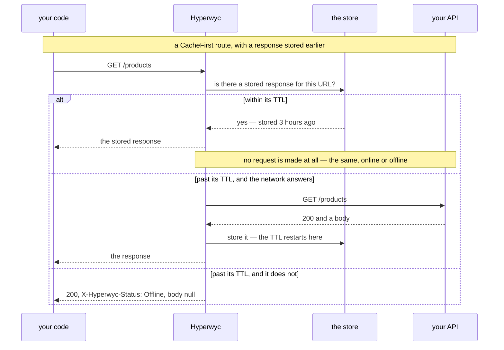

# Delivery and Route Policies

This document explains where a response comes from, how long it stays usable, and how to vary both per route.

Hyperwyc sits in your `HttpClient` pipeline as a `DelegatingHandler`, the same interception point that a Service Worker occupies for browser `fetch()`. It transparently handles all outgoing requests:

- **Online:** Requests are sent immediately. Responses are optionally cached according to your staleness policy.
- **Offline writes:** Requests are serialised and queued locally. The caller receives a [`202 Accepted` with an `X-Hyperwyc-Status: Queued` header](responses.md). When connectivity is restored, the queue is replayed in order. The eventual outcome arrives on [`Events`](events.md), correlated back to the write that produced it.
- **Offline reads:** Served from cache if it is still within its TTL. Otherwise the caller receives a [`200 OK` with `X-Hyperwyc-Status: Offline`](responses.md) and a body of `null`. A read whose transport cannot answer is treated identically, whatever the connectivity service claimed, so a read never throws where being offline would not have thrown.
- **Online reads (GET/HEAD/OPTIONS):** Served from cache if fresh; fetched from the API if stale or missing.

## Route Policies

Route policies affect how Hyperwyc handles read (`GET`, `OPTIONS`, `HEAD`) and write (`POST`, `PUT`, `PATCH`, `DELETE`) requests when online and offline.

### Reads

Hyperwyc lets you control when responses should be prioritised from the cache over the network, and vice versa.

| Strategy                    | Online                                                                    | Offline                                                                |
| --------------------------- | ------------------------------------------------------------------------- | ------------------------------------------------------------------------ |
| `RoutePolicy.CacheFirst()`  | Serve a stored response within its TTL; otherwise fetch                   | Serve a stored response within its TTL; otherwise the offline response |
| `RoutePolicy.NetworkFirst()`| Always fetch; fall back to a stored response within its TTL if that fails  | Serve a stored response within its TTL; otherwise the offline response |
| `RoutePolicy.NetworkOnly()` | Always fetch; never read or write the store                               | The offline response — nothing to serve, and nothing to pass through to |

Each has a `(ttl)` overload that sets [`Ttl`](#understanding-ttl) and changes nothing else. **The TTL means the same thing offline as online**: past it, a stored response is not served, and if offline the caller gets the [offline response](responses.md) as though nothing were cached.

Hyperwyc *always* refreshes the cache and resets the TTL on a successful network fetch (except for `NetworkOnly`).

### Writes

Hyperwyc behaves the same way when online whatever the strategy, with one exception below: it attempts the request, and returns the response if one is received. It doesn't matter what the response is or whether the request failed; that's none of Hyperwyc's business, it just returns the response to the caller.

**Hyperwyc queues the request to send later *only* if a response is not received.** A request that failed on the API side was still sent successfully, and as a transport layer tool, Hyperwyc is no longer needed. A request that *failed to send* is Hyperwyc's business, so a transport failure that means no connection was ever established is queued — see [Offline writes](offline-writes.md#writes-are-queued-on-transport-failure-too-not-just-when-you-are-offline) for exactly which those are.

The exception is `NetworkOnly`, which declines to queue in either case. Offline it does not take custody, and online a transport failure is allowed to throw.

## Per-route policies

The default is `RoutePolicy.CacheFirst()` — cache-first, a TTL of one day, `InvalidateCacheOnWrite` on — and it applies to everything. Set it on `options.Routes.Default`. Override it per route, **registering from general to specific — each rule refines the ones before it**:

```csharp
services.AddHyperwyc(options =>
{
    options.Routes
        .For("/api/*",           RoutePolicy.CacheFirst(TimeSpan.FromHours(1)))
        .For("/api/sales/*",     RoutePolicy.NetworkFirst(TimeSpan.FromSeconds(30)))
        .For("/api/payments/*",  RoutePolicy.NetworkOnly());
});
```

It's the same model as `.gitignore` and the CSS cascade: state the general rule, then carve out the exceptions. Where two patterns both match, the one registered later applies, so a broad rule placed *after* a narrow one will override it.

Patterns match on the URL **path** only — scheme, host, port and query string are ignored, so a pattern works whatever your `BaseAddress` is. `/api/sales/*` covers `/api/sales` and everything beneath it; `*` matches everything; matching is case-insensitive.

A policy carries four things:

| Member                        | Default          |                                                                                            |
| ----------------------------- | ---------------- | ------------------------------------------------------------------------------------------ |
| `SourcePriority`              | `CacheFirst`     | How reads are served                                                                       |
| `Ttl`                         | 1 day            | How old a stored response may be and still be served, online or offline                    |
| `InvalidateCacheOnWrite`      | `true`           | Whether a successful write clears stored responses under the same path prefix              |
| `MaxCachedResponseBodyBytes`  | unset — inherits | The largest response body cached on this route. Unset defers to the application-wide cap    |

Use the factory methods (as per [Route Policies](#route-policies)) and compose with `with` for anything the factories don't cover:

```csharp
.For("/api/audit/*", RoutePolicy.CacheFirst(TimeSpan.FromDays(7)) with { InvalidateCacheOnWrite = false })
```

### How big a response may be

`HyperwycOptions.MaxCachedResponseBodyBytes` is the application-wide cap, 512 KB by default. A response larger than it is returned to the caller in full and simply not stored.

One number rarely fits a whole API. Raise the global cap for the one endpoint that returns a document and every other route gains headroom it never needed — on a store that [nothing evicts from](storage.md#one-thing-to-know-before-you-ship), that headroom is what fills the disk. So set the cap per route instead, and leave the global one where it is:

```csharp
services.AddHyperwyc(options =>
{
    options.MaxCachedResponseBodyBytes = 256 * 1024;         // the rest of the app

    options.Routes
        .For("/api/reports/*", RoutePolicy.CacheFirst(TimeSpan.FromDays(1))
            with { MaxCachedResponseBodyBytes = 4 * 1024 * 1024 })   // this one returns documents
        .For("/api/feed/*",    RoutePolicy.NetworkFirst()
            with { MaxCachedResponseBodyBytes = 0 });                // and this one stores nothing
});
```

Unlike `Ttl`, this **is** inherited when you leave it unset — a TTL has no safe fallback, whereas a size cap has exactly one, the number you already chose for the application. So a policy that doesn't mention it gets the global value rather than a fresh default.

`0` caches no bodies at all on that route, which is the narrow version of `NetworkOnly` — the route is still fetched, still invalidated on write, and just stores nothing. There is no "unlimited" value and none is needed: a body is a `byte[]`, so `int.MaxValue` already exceeds anything that could be cached. A negative cap throws `ArgumentOutOfRangeException` when Hyperwyc is registered, naming the route that set it, rather than silently behaving as `0`.

> **`NetworkOnly` governs writes as well as reads.** It's the one strategy that does. A write to
> a `NetworkOnly` route is **never queued** — not when offline, and not when the transport fails
> after Hyperwyc believed it was online. It goes to the transport and fails as it
> would without Hyperwyc installed. Use it where deferring a write is the wrong answer even
> though deferring a read would be fine: a payment, a seat reservation, anything contending for a
> shared mutable resource.

## Understanding TTL

TTL (time to live) in a Hyperwyc cache defines *whether or not a response is still valid*, not whether to refetch.

It means the same thing online and offline. Once it expires, the response is not served: online it is refetched, offline the caller gets the same "no data" answer as if nothing were cached.



The first branch is the point: inside the TTL there is no request, and connectivity does not come into it. `NetworkFirst` reverses the order — it always tries the network first and consults the store only when that fails — but the TTL means the same thing in both, because it governs whether a stored response may be *served*, not when to go looking for a fresh one.

So set it to how long the data is genuinely useful, not to how often you would like to refresh. "Always fetch when I can" is `NetworkFirst`, which is a strategy; using a short TTL to force refetching would leave you nothing to serve offline, which is the opposite of the point. The default is one day.

`NetworkOnly` opts out of the store entirely, so it has nothing to offer offline.

The app doesn't need to know the difference. Your existing code doesn't change.

## What a caller gets when there is nothing to give

An offline read with no cached copy, and a write that has only been queued, both return the JSON `null` literal rather than an empty body:

```csharp
var product  = await http.GetFromJsonAsync<Product>("/products/1");        // null
var products = await http.GetFromJsonAsync<List<Product>>("/products");    // null
```

Both return `null` rather than throwing, with or without the JSON extension methods. [Why `null` and not an empty body](design.md#null-rather-than-an-empty-body) is on the design page; the short version is that an empty body is not JSON at all, so `GetFromJsonAsync<T>` throws on it.

```csharp
var products = await http.GetFromJsonAsync<List<Product>>("/products");

if (products is null)
{
    // Offline with nothing cached. Show an empty state, or check
    // X-Hyperwyc-Status if you want to say why.
    return [];
}
```

In almost every case your code already needs to handle a `null` result, whether using the JSON extension methods, using plain `HttpClient`, or even calling other API types (like SOAP/XML). At some point you need to deserialise the response, which can return `null` — `JsonSerializer.Deserialize<T>` and the `HttpClient` JSON extensions all return `T?` — or you need to read string content. This last scenario is the only one where you may need to do something different - if you are reading literal string content, your code needs to check for the exact string match `null`.

**A collection comes back as `null`, not empty**, which may differ from what your API does. A null-coalesce at the call site covers it, and you need one for the online path anyway.

If you would rather branch on status codes than on `null`, read [`X-Hyperwyc-Status`](responses.md) to find out. And if your API already uses an envelope or result type — [`Ardalis.Result`](https://github.com/ardalis/Result) or a hand-rolled `ApiResponse<T>` — that keeps working, since the envelope simply deserialises to `null` and your existing handling takes over.
