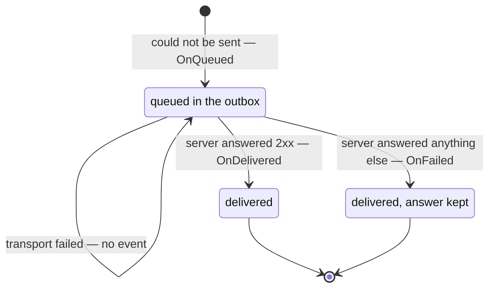

# Offline writes

What happens to a write made with no network, when it is replayed, and how to find out what the server eventually said.

## When Hyperwyc delivers

Queued writes are flushed automatically by two triggers:

| Trigger               | When                                                       |
| --------------------- | ---------------------------------------------------------- |
| Application start     | `FlushOnStartup` (default `true`), if the device is online |
| Connectivity restored | While the app is running                                   |

You can also call this explicitly, for example if certain lifecycle events in your app warrant it, or for a user-facing "sync now" control (something you should do if you expose queued writes to your users):

```csharp
await hyperwyc.FlushAsync();   // IHyperwyc, resolved from DI
```

## You don't need to hook app lifecycle events

**Shutting down or backgrounding the app is deliberately not a sync trigger**, and you should not add one. Writes are only ever queued because connectivity was poor, and closing the app doesn't improve connectivity, so a flush at that moment would fail for the same reason the work was queued in the first place.

Anything still queued is replayed at next launch. Nothing is lost, so there is nothing to rescue on the way out.

This matters most on mobile, where it wouldn't work anyway: Android and iOS terminate suspended processes without running disposal, finalizers, or any cleanup you might have registered. Durability comes from the outbox being persistent, not from tidying up at exit.

## What happens when a write goes out

One distinction decides everything: **did the server answer?**

Not *what* it answered. [Hyperwyc succeeds or fails at delivery](design.md#delivery-is-what-hyperwyc-succeeds-or-fails-at), and HTTP's own idea of success is a different axis that happens to use the same word.

| | What happens |
| ----------------------------------------------------- | ----------------------------------------------------------------------------------------------------------------------------- |
| The server answered — with anything at all | The delivery is complete. The status, reason phrase and body are recorded and reported on [`Events`](events.md). The request reached the API, which was the job |
| No response at all — the connection failed            | Left queued. The flush stops and nothing is held against the remaining writes; the network being down says nothing about them |



Every transition raises an event except one. A delivery attempt that fails at the transport records its outcome on the envelope and stops the flush, and publishes nothing at all — so from the event stream, a write that cannot be delivered simply goes quiet until it can be.

**The two right-hand states differ in what is kept, not in whether Hyperwyc did its job.** A `2xx` leaves the outbox and nothing is retained, because there is nothing you need from it. Any other answer is retained along with what the server said, so your application can still find out after a restart. Both are complete: the request reached your API, which is the whole of what Hyperwyc promised.

> **A note on "dead-letter", which is on its way out.** The API calls that second state dead-lettered — `IHyperwycStore.MoveToDeadLetterAsync`, `Envelope.IsDeadLettered`, the `OnFailed` event — borrowing a term from message queues where it means *we gave up on this*. Here it does not: the write was delivered, and what is kept is your API's answer to it.
>
> The retention itself is under review. Keeping the answer is arguably not Hyperwyc's job either — it is an ordinary HTTP response, and the only Hyperwyc-shaped part of it is the [event](events.md) telling you it arrived for a request whose caller had already moved on. Expect this to get smaller rather than better named.

**Any answer is a final outcome, including a `500`, a `429` or a `503`.** Remember that Hyperwyc's job is to make sure your request reaches your back end, and a response, any response, means it has succeeded. Hyperwyc is not responsible for retrying failed requests; it has exactly three triggers — application start, connectivity restored, and an explicit `FlushAsync()` — and none of them correlates with a change to the condition under which the request failed. Requeuing a `503` schedules a retry on an unrelated event, and for a device that never goes offline again it schedules one that never arrives. A write kept on that promise is kept forever.

Other approaches handle these failures, and can be wired into your pipeline with a resilience handler such as [Polly](https://github.com/App-vNext/Polly), which retries on a schedule that tracks the actual failure before Hyperwyc ever sees the result. [Why Hyperwyc does not retry](design.md#hyperwyc-does-not-retry) has the rest.

**Note:** If you use a resilience handler such as Polly, register it *after* `AddHyperwycHandler()` and supply an `IConnectivityService`. When Hyperwyc believes it is offline it answers from the handler and the rest of the pipeline is never invoked, so there is no doomed first attempt and no backoff to sit through — see [Pipeline placement](pipeline.md). In a UI app that is the difference between an instant cached read and a retry schedule the user waits out.

## Duplicate writes

Any retry can deliver the same request twice. If a response is lost after the server has already committed, the retry looks identical to a first attempt. This is true of a Polly retry handler, a user double-tapping a button, or a proxy replaying a request. Hyperwyc's retry carries the same risk and no more.

**Hyperwyc takes no position on it**, and you can see why [in detail here](design.md#hyperwyc-takes-no-position-on-duplicates). It sends no headers of its own on the wire — the [two it adds](responses.md#headers) go on *responses* it synthesises, so your server never sees them. If duplicate suppression matters to you, approaches people use include:

- **Client-generated domain identity** — the record carries an id chosen by the client, so a repeated write updates rather than duplicates (or rejects with a `409`; the update may be valid for `PUT` or `PATCH` but not `POST`, but, again, this is the business of your API, not Hyperwyc). Idempotent by construction, and nothing in the transport needs to know.
- **The [`Idempotency-Key`](https://datatracker.ietf.org/doc/draft-ietf-httpapi-idempotency-key-header/) header**, set at the call site, if your backend implements it. Hyperwyc persists request headers and replays them unchanged, so a key you set once stays stable across every retry:

  ```csharp
  request.Headers.Add("Idempotency-Key", sale.Id.ToString());
  ```

- **A correlation or transaction id you already emit** — common in event-driven systems, and increasingly generated in the UI so analytics can be tied to backend telemetry.

These are things people do, not a recommendation from Hyperwyc. Which one fits, or whether the concern applies at all, depends on your solution.

## Writes are queued on transport failure too, not just when you are offline

Hyperwyc does not only queue when `IConnectivityService` says offline. If a write is attempted because the device reports connected, and **the transport cannot establish a connection at all**, that write is queued and answered with the same `202` as if it had been made offline.

This matters because every connectivity implementation is wrong sometimes — a captive portal, a signal that drops between the check and the send, or `AlwaysOnlineConnectivityService` on a device that is not. Without this, being wrong would cost the write. With it, being wrong costs an attempt.

> **Only when nothing was sent.** Hyperwyc queues on the transport errors that mean no connection
> was ever established — DNS failure, connection refused, TLS handshake failure, proxy tunnel
> failure. If a connection *was* made and the failure came later, the request is not queued and
> the exception reaches you: the server may have processed it, and quietly replaying it would
> risk a duplicate on a guess. Those are also failures no connectivity change would fix.

The same rule the rest of the library follows: connectivity is a *hint* about which path to try first, and where the transport is consulted, it is what actually knows. Note the limit: a connectivity service that wrongly reports *offline* is never contradicted, because no request is made to contradict it. That write is queued rather than sent, and only goes out on the next connectivity change, or when the `IHyperwyc.FlushAsync()` method is called.

## Interrupted deliveries

If a flush is cut short, e.g. the app is backgrounded mid-replay, or the process is killed, the envelopes it hadn't delivered stay queued and go out on the next trigger. They are not marked as failed, and they are not dead-lettered. Only a request the server actually rejected ends up in the dead-letter queue.

