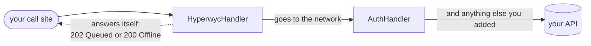

# Pipeline placement

Where Hyperwyc's handler sits in your `HttpClient` pipeline, and what that means for authentication and for replayed requests.

Hyperwyc does not manage authentication, your existing handler does that. Register Hyperwyc's handler **first**, so everything after it also applies to replayed requests:

```csharp
services.AddHttpClient("MyApi")
    .AddHyperwycHandler()                     // queues and replays
    .AddHttpMessageHandler<AuthHandler>();    // adds a fresh token at send time
```

This works because **a replayed write goes back through the same pipeline it was made on.** Hyperwyc steps aside for replays, it doesn't re-queue them, and every handler after it runs normally. So a write queued on Monday and replayed on Tuesday is authenticated with Tuesday's token, not the one that was current when it was queued.

**There is a second reason, and it is about what reaches the disk.** Hyperwyc persists the request as it sees it, every header included, because a replay has to reproduce it — see [what ends up on disk](storage.md#what-ends-up-on-disk). A handler registered *after* `AddHyperwycHandler()` runs once the envelope has already been serialised, so a credential it adds is never captured at all. Register your auth handler first instead and the token it stamped goes into the store with the write, and sits there until the write is delivered.

The same applies to anything else you put in the pipeline: logging, correlation IDs, telemetry, custom retry. Register it after `AddHyperwycHandler()` and replays get it too.

> **Use `AddHyperwycHandler()`, not `AddHttpMessageHandler<HyperwycHandler>()`.** The former
> captures the client's name, which is how Hyperwyc knows which pipeline to replay a queued
> write through. The plain form still works, but replays fall back to a bare transport with
> none of your handlers in it.

## What Hyperwyc sees, and what it leaves alone

Handler order follows the order you add them: **the first handler you add is the first to see the request, and the last to see the response.**

```
request  →  Hyperwyc  →  AuthHandler  →  network
response ←  Hyperwyc  ←  AuthHandler  ←  network
```

So a handler registered *after* `AddHyperwycHandler()` sees each response **before** Hyperwyc does, and can resolve failures Hyperwyc never learns about. If you already have a handler that catches a `401`, refreshes the token and retries, that is exactly what happens — Hyperwyc sees the successful retry, not the `401`.

That's the order you should deliberately adopt. **Hyperwyc is the last resort, not a retry layer**: it wraps the whole pipeline, so it only ever acts on failures your own handlers couldn't fix. It won't second-guess your auth, your circuit breaker or your fallbacks, and you don't need to configure it to stay out of their way.

Hyperwyc makes **one delivery attempt per queued write per flush** — it does not loop. A write the server answers is finished with, whatever it said; only one whose transport never reached the API stays queued. So your own retry handler, if you have one, composes rather than compounds: it retries within a single attempt, and Hyperwyc decides whether there should be another attempt at all.

## Replays and `ReplayTransport`

`AddHyperwycHandler()` works on a typed client as well as a named one: `AddHttpClient<IProductsApi, ProductsApi>()` sets the builder's name to the type name, so the capture works and replays go back through that client's pipeline. That is the registration most applications actually use.

For the fallback case — a handler registered without a client name — `options.ReplayTransport` sets the transport replays use. It's also useful for exercising a flush in tests without network access, by supplying a stub. Hyperwyc never disposes it; one you provide stays yours to dispose.

## Hyperwyc short-circuits the pipeline when it answers

[Synthetic responses](responses.md) — the `202` for a queued write, the `200` for a read with nothing to serve — are returned directly from the handler. **Any `DelegatingHandler` registered after `HyperwycHandler` is not invoked** on that path.



The dotted path is the one to notice: it returns to your call site without ever reaching the handlers to its right.

That is deliberate — there is no outbound request to authenticate or mutate. But it decides where your own handlers go.

| Your handler                                                                | Where it goes                     | Why                                                                                                                                                     |
| --------------------------------------------------------------------------- | --------------------------------- | ------------------------------------------------------------------------------------------------------------------------------------------------------- |
| Must run on **every logical request** — logging, telemetry, header stamping | **Before** `AddHyperwycHandler()` | Otherwise it silently stops running whenever Hyperwyc answers                                                                                           |
| Only matters when a request actually goes out — auth, resilience, retries   | **After** `AddHyperwycHandler()`  | It is skipped when there is nothing to send, which is the point. A resilience handler placed here never retries a request that was never going to leave |

Everything else — anything costly or slow to run when offline — belongs after, so that Hyperwyc can short-circuit it.

